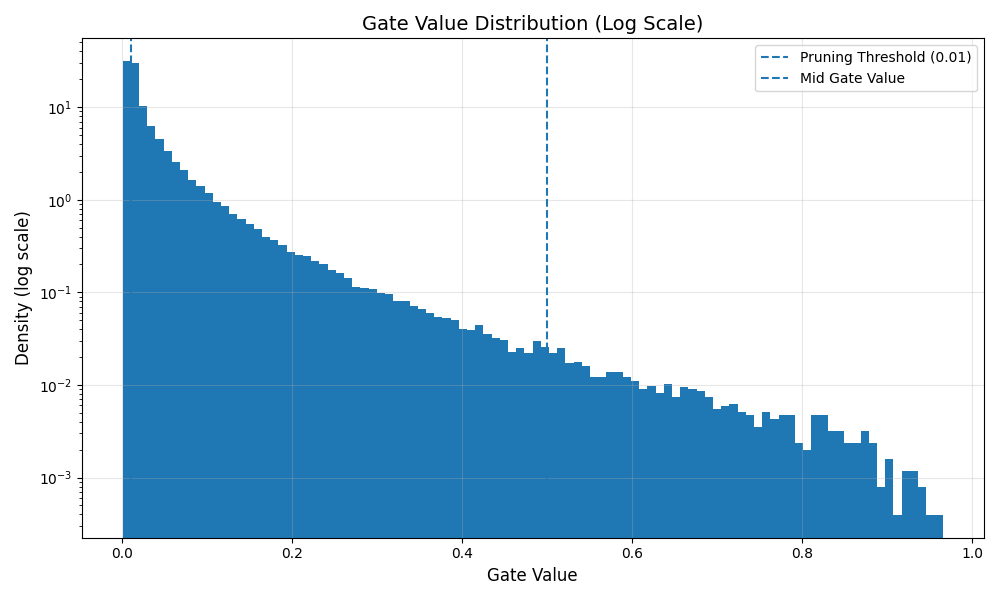

# Self-Pruning Neural Network Report

## 1. Introduction

In this project, I implemented a self-pruning neural network where each weight is controlled by a learnable gate. The idea is that instead of manually removing weights after training, the model itself learns which connections are not useful and gradually removes them during training by pushing their corresponding gate values toward zero.

## 2. Why L1 Penalty Encourages Sparsity

To make the model learn sparsity, I added an L1 regularization term on the gate values. The total loss function used is:

Total Loss = Classification Loss + λ × Sparsity Loss

Where:
- Gates are computed using a sigmoid function:
  gate = sigmoid(gate_scores)
- Sparsity Loss is the sum of all gate values

### Explanation:

L1 regularization is commonly used when we want sparse solutions. It works by continuously pushing values toward zero. Compared to L2 regularization, L1 is more effective at making values exactly zero instead of just small.

In this model:
- Gate values lie between 0 and 1 due to the sigmoid function
- Minimizing the sum of gate values forces many of them toward 0
- When a gate becomes very close to 0, the corresponding weight is effectively removed

So, by adding this penalty, the network automatically learns which connections are unnecessary and prunes them during training.

## 3. Results

I trained the model with different values of λ to observe how it affects accuracy and sparsity.

| Lambda | Test Accuracy (%) | Sparsity Level (%) |
|--------|------------------|--------------------|
| 0.0001 | 59.41%           | 31.14%             |
| 0.001  | 56.83%           | 48.72%             |
| 0.01   | 46.96%           | 59.36%             |

## 4. Analysis of λ Trade-off

From the results, a clear pattern can be observed:

- When λ is small:
  - The sparsity penalty is weak
  - The model keeps most connections
  - Accuracy is relatively higher

- When λ is large:
  - The sparsity penalty becomes stronger
  - More gates are pushed toward zero
  - The model prunes more connections
  - Accuracy starts to drop

### Key Observation:

There is a clear trade-off between accuracy and sparsity:

- Lower λ → higher accuracy, lower sparsity  
- Higher λ → lower accuracy, higher sparsity  

This shows that the model is successfully learning to prune itself, but too much pruning can hurt performance.

## 5. Gate Value Distribution

Below is the histogram of gate values for the best-performing model:

### Interpretation:

- There is a noticeable concentration of gate values near 0, which indicates that many connections have been pruned
- At the same time, there are gate values spread away from 0, representing important connections that the model has kept
- Using a log scale makes it easier to see both the dense region near zero and the smaller number of larger values

This distribution confirms that the model has learned a sparse structure instead of removing everything blindly.

## 6. Conclusion

Overall, the self-pruning neural network worked as expected. The model was able to:

- Learn which connections are important and which are not
- Automatically prune unnecessary weights during training
- Show a clear relationship between sparsity and accuracy

The experiments also demonstrate that increasing λ leads to more aggressive pruning, but at the cost of reduced accuracy. This matches the expected behavior and highlights the importance of choosing a suitable λ value.
